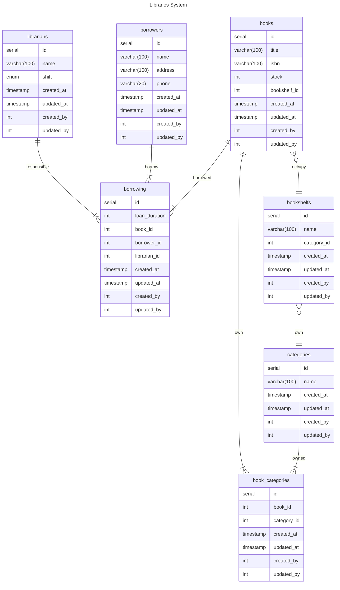

# ERD Libraries System

```mermaid
---
    title: Libraries System
---
erDiagram
    books{
        serial id
        varchar(100) title
        varchar(100) isbn
        int stock
        int bookshelf_id
        timestamp created_at
        timestamp updated_at
        int created_by
        int updated_by
    }

    categories{
        serial id
        varchar(100) name
        timestamp created_at
        timestamp updated_at
        int created_by
        int updated_by
    }

    bookshelfs{
        serial id
        varchar(100) name
        int category_id
        timestamp created_at
        timestamp updated_at
        int created_by
        int updated_by
    }

    librarians{
        serial id
        varchar(100) name
        enum shift
        timestamp created_at
        timestamp updated_at
        int created_by
        int updated_by
    }

    borrowers{
        serial id
        varchar(100) name
        varchar(100) address
        varchar(20) phone
        timestamp created_at
        timestamp updated_at
        int created_by
        int updated_by
    }

    borrowing{
        serial id
        int loan_duration
        int book_id
        int borrower_id
        int librarian_id
        timestamp created_at
        timestamp updated_at
        int created_by
        int updated_by
    }

    book_categories{
        serial id
        int book_id
        int category_id
        timestamp created_at
        timestamp updated_at
        int created_by
        int updated_by
    }

    librarians ||--|{ borrowing : responsible
    borrowers ||--|{ borrowing : borrow
    books ||--|{ borrowing : borrowed
    books ||--|{ book_categories : own
    categories ||--|{ book_categories : owned
    books }o--|| bookshelfs : occupy
    bookshelfs }o--|| categories : own
```
