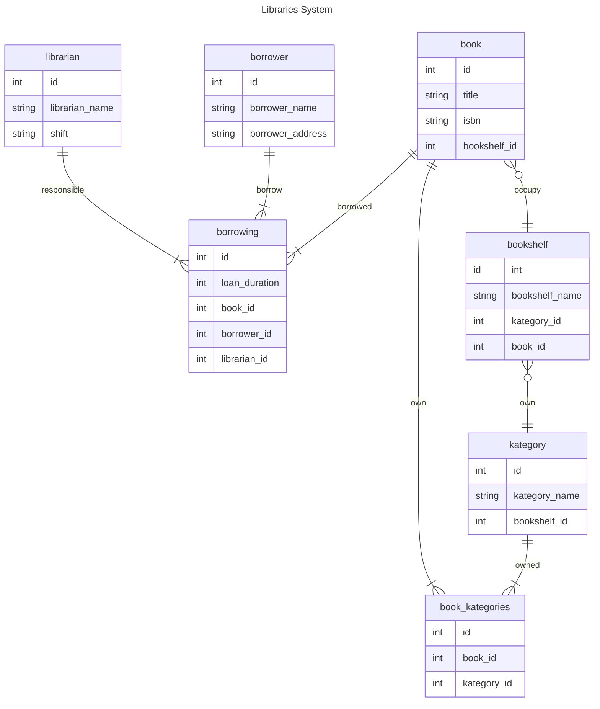

# ERD Libraries System

```mermaid
---
    title: Libraries System
---
erDiagram
    book{
        int id
        string title
        string isbn
        int bookshelf_id
    }

    kategory{
        int id
        string kategory_name
        int bookshelf_id
    }

    bookshelf{
        id int
        string bookshelf_name
        int kategory_id
        int book_id
    }

    librarian{
        int id
        string librarian_name
        string shift
    }

    borrower{
        int id
        string borrower_name
        string borrower_address
    }

    borrowing{
        int id
        int loan_duration
        int book_id
        int borrower_id
        int librarian_id
    }

    book_kategories{
        int id
        int book_id
        int kategory_id
    }

    librarian ||--|{ borrowing : responsible
    borrower ||--|{ borrowing : borrow
    book ||--|{ borrowing : borrowed
    book ||--|{ book_kategories : own
    kategory ||--|{ book_kategories : owned
    book }o--|| bookshelf : occupy
    bookshelf }o--|| kategory : own
```
