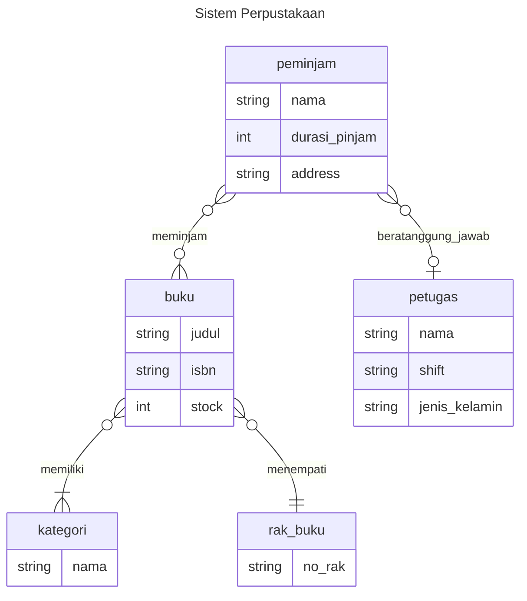

# ERD Sistem Perpustakaan

```mermaid
---
    title: Sistem Perpustakaan
---
erDiagram
    buku{
        string judul
        string isbn
        int stock
    }

    kategori{
        string nama
    }

    rak_buku{
        string no_rak
    }

    petugas{
        string nama
        string shift
        string jenis_kelamin
    }

    peminjam{
        string nama
        int durasi_pinjam
        string address
    }

    buku }o--|{ kategori : memiliki
    buku }o--|| rak_buku : menempati
    peminjam }o--o{ buku : meminjam
    peminjam }o--o| petugas : beratanggung_jawab
```
